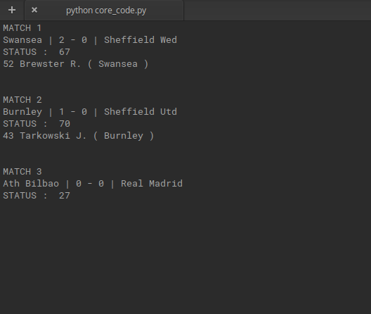
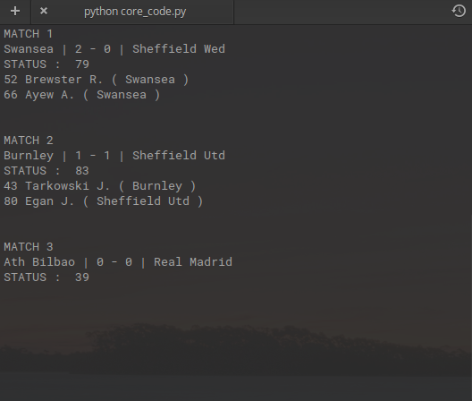

<a href="">
</a>
<h1>Live-Football</h1>

<p>A tool to fetch the live scores from the football matches around the world.</p>


<a href="https://www.python.org">

</a>
<a href="LICENSE">

</a>
<br>


<h2>Pre-requisites</h2>
<p> First, you need to sign up <a href="https://allsportsapi.com">here</a>. Create an account and store your API key somewhere accessible. There are various plans depending on the usage while the free trial only supports two random leagues which don't seem to be random at all ! They are always the same two leagues with very limited audience. But, one can sign up for their best plan as on a trial basis with no credit card details or such. Once that plan expires, you could again sign up with a new account. Yeah, I agree that doesn't seem to be very convenient.</p>

<h2>Installation</h2>
<p> Once, you get your API key, you can proceed to the following.</p>

<p>Clone or download the repository in your preferred directory :</p>

  ```
  git clone https://github.com/InvincibleJuggernaut/Live-Football.git
  ```
  
<h2>Usage</h2>
<ol type="I">
  <li> Open the local repository folder and open the file <i>core_code.py</i> and insert your API key in the code where its needed.</li>
  <br>
  <li> Save the code and go back to the repository</li>
  <br>
  <li> Now, open the terminal inside the repository folder</li>
  <br>
  <li> Run the program using</li>

```
python core_code.py
```

 </ol>

<p> This program makes use of <a href="https://allsportsapi.com/">All Sports API</a>. 
<p> The standard API key for LIVE results is of the form : 
  
  ```
  https://allsportsapi.com/api/football/?met=Livescore&APIkey=<insert your API key here>
  ```
<p> That said, the URL can be tweaked to get other statistics as well. If you want results from specific leagues, then append <i>&leagueId=</i> after <i>?met=Livescore</i> followed by the actual id. For example, if you want to get scores from the English Premier League only, then your API call would look something like this :</p>

  ```
  https://allsportsapi.com/api/football/?met=Livescore&leagueId=148&APIkey=<insert your API key here>
  ```
<p> Similarly, the results can be refined according to the user's needs. To know more details about how to get specific results, check this <a href="https://allsportsapi.com/soccer-football-api-documentation">documentation</a>.</p>

<p> For reference, I am adding the leagueId for the top 5 leagues:</p>
  
  ``` 
  English Premier League - #148 
  Spanish LaLiga         - #468
  Serie A                - #262
  Bundesliga             - #195
  Ligue 1                - #176
  ```

<p> To check the league codes for specific leagues, check this <a href="https://allsportsapi.com/soccer-football-api-coverage">link</a>.</p>

<p> This repository also contains a file <i>code_gui.py</i> which does the same task but displays the scores in a GUI. The interface isn't that polished though, so I won't recommend using that one yet. But, if you still want to try it out, follow the same steps as above until III and in step IV, run the file using:

```
python code_gui.py
```

<p align="center">
    
</p>
<p align="center">
  
</p>

<h2> Future Plans </h2>

- [ ] It would be better to give up the API itself and fetch the scores without using any API at all. 
- [ ] Having the scores displayed in a more user-friendly window would be more appealing instead of terminal.
- [ ] Getting optional notifications when a major event occurs during a match i.e goal scored, a red card or an injury.


<h2>License</h2>
<a href="LICENSE">MIT License</a>
 
